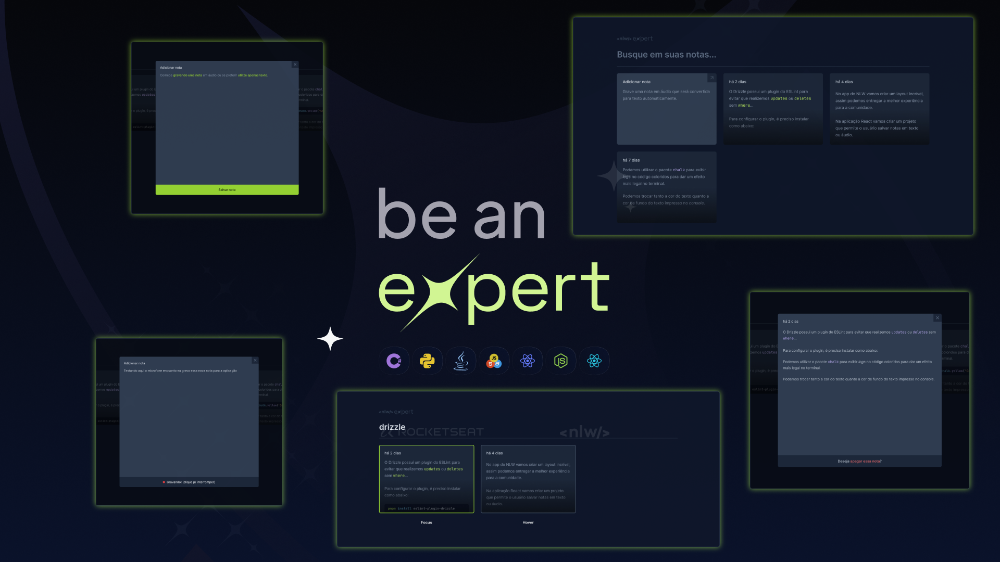

  

  

 

  

## ✨ Tecnologias

Esse projeto foi desenvolvido com as seguintes tecnologias:

- [React JS](https://pt-br.reactjs.org/)
- [Typescript](https://www.typescriptlang.org/)
- [ViteJS](https://vitejs.dev/)
- [Tailwindcss](https://tailwindcss.com/)
- [radix-ui](https://www.radix-ui.com/)

## 💻 Projeto

Aplicação foi desenvolvida na NLW Expert da Rocketseat, aplicação para realizar anotações, com a opção de anotar o que falar convertendo a voz em texto.

## 🚀 Como executar

- Clone o repositório
- Instale as dependências com `npm install`
- Inicie o projeto em modo desenvolvedor com `npm run dev`

## ⚙ Script e Deploy

- Script de build: `npm run build`
- Script de Preview: `npm run preview`

## 📄 Ambiente de produção

Github Pages para acessar [click aqui](https://ander5onpereira.github.io/nlw-expert/)

## 📄 Licença

Esse projeto está sob a licença MIT. Veja o arquivo [LICENSE](LICENSE.md) para mais detalhes.
